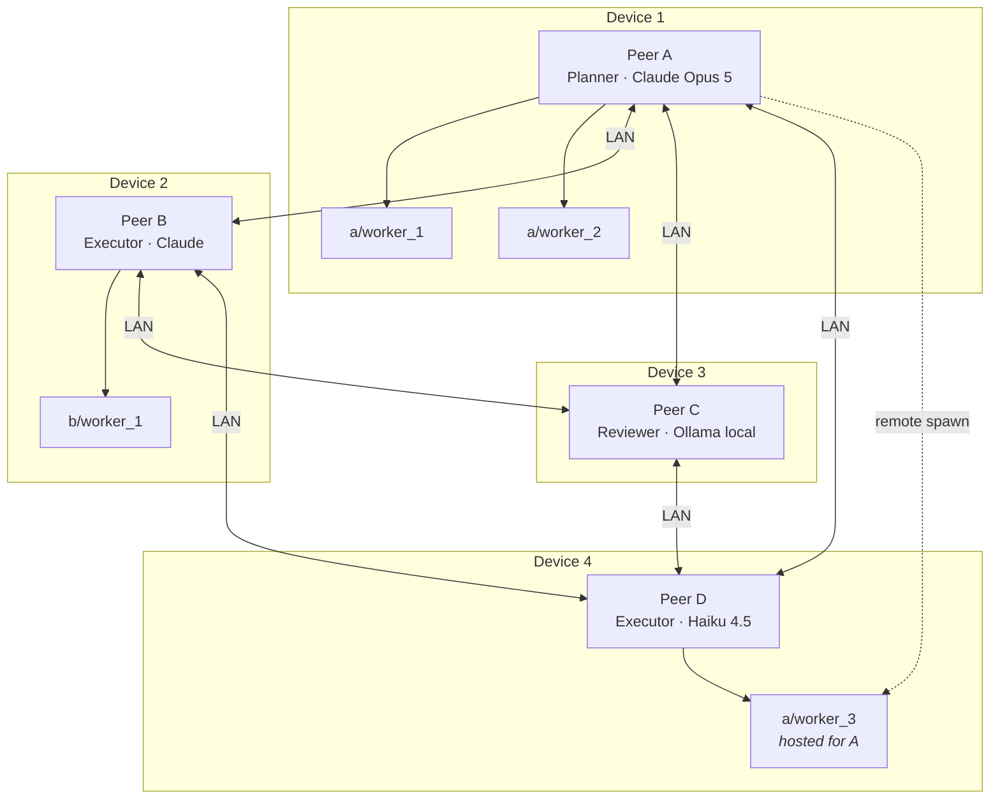
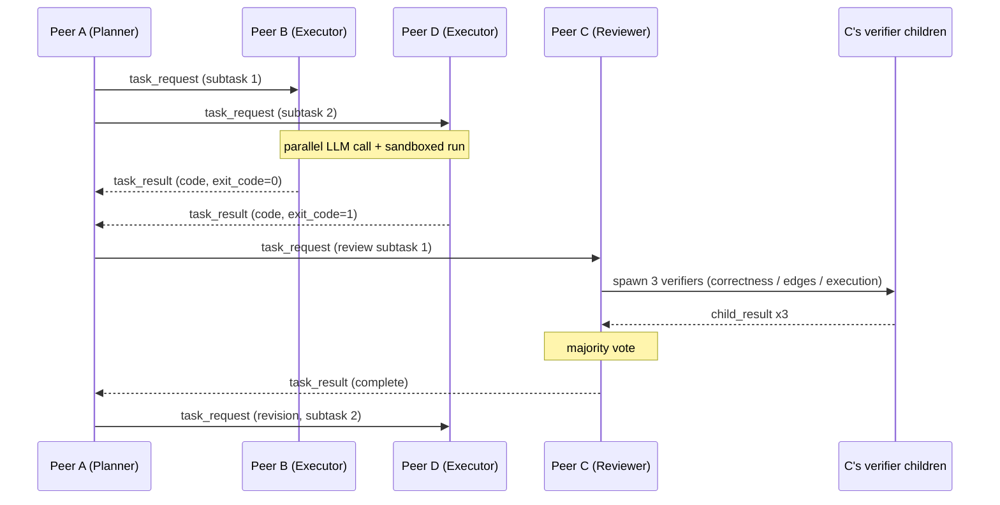

# Samvad

### Four devices. Four agents. Agents that spawn agents.

*Multi-Agent System · Computer Technology Course Project · Author: Aditya Patil · Team of 4*

---

## Overview

Samvad is a distributed multi-agent system where each agent runs on a separate physical device, connected over the same local network. Agents exchange signed, structured JSON messages to work through a shared task together, and each agent can **spawn ephemeral child agents** — locally, or on a peer's device — to parallelise its own work.

No shared process. No central server. No global clock. Independent agents that know about each other only through the network.

## The Name

**Samvad** — Hindi/Sanskrit for "dialogue" or "conversation." Direct and literal: agents in dialogue, across a network.

## Problem / Motivation

Most "multi-agent" demos run every agent in the same process on the same machine — objects calling each other's methods in memory. That is multi-agent in name only. It skips the actual hard part: agents as independent processes on independent machines, that can only reach each other through an unreliable network.

Samvad is built to demonstrate real distributed coordination — networking, async I/O, failure handling, resource accounting, and agent orchestration together, not simulated.

**We hold ourselves to that claim by measuring it.** The same workload runs over three transports — in-process queue, loopback, and real LAN — and we report the difference. See [Measurements](#measurements).

---

## Architecture

Samvad has two tiers. The static tier is the network; the dynamic tier is the parallelism.

| Tier | What | Lifetime | Count |
|---|---|---|---|
| **Peers** | One permanent agent per device, one per team member, each on a different model backend | Whole session | 4 (configurable; degrades to 2) |
| **Children** | Ephemeral workers spawned by a peer for a specific subtask | One task | Unbounded, budget-limited |

Every agent — peer or child — runs the **same binary**, differing only in config and system prompt. There is no "Agent A codebase."

### System Diagram



`a/worker_3` runs on Device 4 but belongs to Peer A — A was out of context, D had a fresh window. See [Work Placement](#work-placement).

### Transport

Both directions are **fire-and-forget with callback**. Every agent is a pure inbox.

```
A → POST http://B/message   →   B returns 202 {"accepted": msg_id}  (immediately)
                                B runs the LLM call in the background
B → POST http://A/message   →   the result arrives as a NEW inbound message
```

An LLM call takes 5–60 seconds. A synchronous request/response would leave A blocked on an open connection until it timed out — and would make the "async" claim true only inside a process, not on the wire. With callbacks there are no timeouts to tune, both agents are genuinely symmetric (each is server *and* client), and the WebSocket upgrade becomes optional polish rather than a necessary rescue.

The transport is pluggable behind one interface. The same envelope travels over:

| Transport | Used for | Measured |
|---|---|---|
| `inproc` | Child agents on the parent's own device | Yes |
| `loopback` | Children as separate local processes | Yes |
| `lan` | Peer-to-peer between devices | Yes |

### Addressing

Hierarchical paths, routed by **longest-prefix match** — deliberately the same logic as IP routing.

```
agent_b                     a peer
agent_b/worker_2            a child of that peer
agent_b/worker_2/checker_1  a grandchild
```

- **MVP:** static peer table (`192.168.x.x:8000`) in a config file on each device. Reliable on demo day.
- **Stretch:** mDNS/zeroconf — peers find each other with no manual IP entry.
- Children are never in the peer table. They are reached by routing to their peer prefix, which forwards.

### Agent Core

- A role-specific system prompt defines what the agent does (planner, executor, reviewer, verifier).
- The LLM call is wrapped in an async function, so the server keeps accepting inbound messages while a previous call is in flight.
- A **supervisor** owns each agent's children: it tracks them, enforces the concurrency cap, and decides what happens when a child or a parent dies.
- Backends: Claude API for peers that need reasoning depth, Ollama for a fully offline node, `MOCK_LLM=1` for zero-cost development.

---

## Message Protocol v2

Lightweight JSON, FIPA-ACL-inspired but stripped down. Full FIPA compliance is overkill at this scope; a demo-readable envelope is not.

```json
{
  "protocol_version": "2.0",
  "message_id": "b3e1f2a0-1234-4abc-9def-0987654321ab",
  "conversation_id": "conv-7c1e9a",
  "reply_to": "a91c0f3d-...",
  "turn": 4,
  "lamport": 17,

  "sender":   "agent_a",
  "receiver": "agent_b/worker_2",
  "performative": "task_request",

  "root_task": "Implement a binary search function",
  "payload": {
    "subtask": "add unit tests for empty and single-element input",
    "constraints": ["O(log n)", "Python 3.11", "pytest"]
  },

  "artifacts": [
    {"ref": "sha256:9f2a...", "kind": "python_source",
     "summary": "binary search impl, 40 lines", "tokens": 380}
  ],
  "claims": [
    {"claim": "bisect_left is O(log n)", "evidence": "test_output", "evidence_type": "test_output"}
  ],

  "spawn":   {"parent": "agent_a", "depth": 1, "max_depth": 3},
  "budget":  {"usd_remaining": 0.42, "turns_remaining": 8},
  "context": {"used": 14200, "limit": 200000},
  "cost":    {"input": 4200, "output": 830, "cache_read": 3900,
              "usd": 0.0031, "model": "claude-opus-5"},

  "task_status": "in_progress",
  "sig": "hmac-sha256:...",
  "timestamp": "2026-08-24T10:15:00Z"
}
```

Every field maps to a failure mode. Nothing is decorative.

### Performatives

`performative` is the speech act (FIPA's term), not the domain task type — those are different things, and conflating them is why the v1 schema had a `status` field that meant nothing on an outbound request.

| Performative | Meaning |
|---|---|
| `task_request` | Do this |
| `task_result` | Here is the outcome |
| `spawn_request` | Host a child for me (see [Work Placement](#work-placement)) |
| `spawn_ack` / `spawn_refused` | Accepted, or declined with a reason |
| `child_result` | A child reporting to its parent |
| `budget_exhausted` | Refused — no funds. A protocol state, not an exception |
| `uncertain` | I do not know. Escalate to a human |

### Task status

`task_status` belongs to the *task*, not the envelope: `pending`, `in_progress`, `complete`, `needs_revision`, `uncertain`, `abandoned`.

---

## Spawning

### Conserved quantities

Three things flow **down** the spawn tree, and a child can never create more of them than its parent gave it:

```
budget.usd_remaining      sliced among children; the slices sum to the parent's
budget.turns_remaining    same
spawn.depth               monotonically increasing, hard-capped by max_depth
```

A node holding $0.20 that spawns four children gives each $0.05. When a slice can no longer afford a single API call, that branch cannot spawn. **Recursion terminates because it runs out of money**, not because of an arbitrary counter. This is also the only thing preventing a fork bomb — see [Risks](#risks).

Context is *lent*, not conserved: a parent may hand a child artifact references, and the child returns a **summary**, never its transcript. That is how the pool stays larger than any single window.

### Work placement

A child does not have to run on its parent's device. When a peer is near its context limit or under load, it sends `spawn_request` to another peer:

> Peer A is at 95% context and low on budget. It asks Peer D — idle, fresh window, different model — to host `a/worker_3`. D runs it, returns a summary, and bills A's envelope.

The child belongs to A (naming, budget, results) but executes on D. This is work placement across a cluster, and it makes context a genuinely shared, redistributable resource rather than four isolated windows.

A peer may answer `spawn_refused` with a reason (`at_capacity`, `context_full`, `budget_policy`). Refusal is a normal outcome, not an error.

### Supervision and failure

The supervisor per agent decides what happens when things die:

| Event | Behaviour |
|---|---|
| Child crashes | Parent retries once, then reports `needs_revision` upward with the failure attached |
| Parent dies mid-fan-out | Orphans **reparent to the grandparent**; in-flight results still deliver |
| Host peer dies with a remote child | Parent is notified, re-places the child elsewhere with the unspent budget slice |
| Branch exceeds `max_depth` | `spawn_refused`; the work returns to the parent to do itself |

Killing a peer mid-fan-out and watching its children reparent and still deliver is the primary live demo.

---

## Correctness and Hallucination Control

In a multi-agent loop, hallucination does not merely occur — it **launders**. An executor invents a stdlib function, a reviewer LLM agrees, and the error now carries two agents' worth of apparent authority. Two models agreeing is not verification when they share training priors; their errors are correlated.

Controls, in order of how much they actually buy:

**1 — The runtime is the arbiter, not the model.** The executor *runs* the code and returns `{code, test_output, exit_code}`. A reviewer is structurally forbidden from setting `task_status: complete` unless `exit_code == 0`. LLM judgment is advisory.

**2 — "I don't know" is a protocol state.** An agent with no way to express doubt has exactly one option: confabulate. `uncertain` routes to a human prompt at the terminal.

**3 — Adversarial review, not validation.** Reviewers are prompted to *find the input that breaks this*, never to *check whether this is correct*. Confirmation-seeking prompts return confirmations.

**4 — Heterogeneous models.** Each peer runs a different backend — Claude on one device, a local Ollama model on another. Uncorrelated errors mean agreement carries real information. This is measured; see [Measurements](#measurements).

**5 — Diverse verification panels, not redundant ones.** A reviewer spawns three children with *different lenses* (correctness / edge cases / does it actually execute), not three identical copies. Three copies of the same model agreeing is worth almost nothing.

**6 — Self-labelled grounding.** Every claim carries `evidence_type`. Anything tagged `model_prior` is by definition unsupported, and is counted.

**7 — Immutable `root_task`.** Re-injected verbatim into every prompt. By turn six, agents that only ever see paraphrases are solving a different problem — goal drift is hallucination's quiet cousin.

**8 — Artifacts by hash, never by summary.** One agent's prose must never become another's ground truth. Paraphrase is where the telephone game starts.

**9 — Structured output with bounce-back.** Responses are constrained to the schema (`output_config.format`, `strict: true` on tool definitions). On a Pydantic validation failure the message is not patched — the validation error goes back to the model and it retries.

---

## Context Pooling

Four agents with 200K windows is not an 800K pool. Naive history-passing means all four hold the *same* tokens, so the effective pool is 200K, duplicated four times. **Deduplication is the whole win. Partition; do not broadcast.**

**Content-addressed artifact store.** Each agent keeps a local blob store keyed by SHA-256 and exposes `GET /blob/{hash}`. Messages carry references and summaries, not payloads. The receiver hydrates only what it decides it needs. This is how git works.

**Context backpressure.** Every message declares the sender's own `context: {used, limit}`, populated by the token-counting endpoint rather than guessed. When a peer sees a neighbour above 90%, it stops shipping full artifacts and sends references only. Flow control, applied to context.

**Asymmetric context is a feature.** The planner never needs the executor's stack traces; the executor never needs the planner's decomposition reasoning. Deliberate withholding is *how* the pool exceeds any single window.

**Tiered memory per agent.** Hot (last N turns verbatim) → warm (summarised) → cold (SQLite, retrieved on demand). Each agent compacts independently; no coordination required.

---

## Metering

Four team members means four API keys, four budgets, and no central ledger. Distributed resource accounting is therefore not a decoration — it is required for the system to function.

**The budget travels with the task.** Each message carries `budget: {usd_remaining, turns_remaining}`. An agent decrements before spending and refuses if the remainder will not cover the call. A distributed resource in flight; no shared state, no consensus problem.

**Every reply reports its own cost.** `cost: {input, output, cache_read, usd, model}` on every `task_result`. The dashboard shows a live running total across the whole mesh.

**Circuit breaker per agent.** A hard per-hour ceiling checked *before* the API call. On trip, the agent returns `budget_exhausted` — a state its peers can reason about, not an exception that kills the process.

**Model routing by task class.**

| Job | Model | Rate (input / output per MTok) |
|---|---|---|
| Planning, code generation | `claude-opus-5` | $5.00 / $25.00 |
| "Is this done?", classification, routing | `claude-haiku-4-5` | $1.00 / $5.00 |
| Offline node | Ollama (local) | free |

Routing judgment calls to Haiku while generation stays on Opus is a 5× cut on roughly half of all calls. The before/after is measured.

**Prompt caching.** The cache is a **prefix match** — any byte change anywhere in the prefix invalidates everything after it, and render order is `tools` → `system` → `messages`. So the frozen system prompt and `root_task` go first and are never mutated; timestamps, message IDs and the peer's latest turn go after the last breakpoint. The minimum cacheable prefix is ~1024 tokens. We verify with `usage.cache_read_input_tokens` — if that is zero across repeated calls, something in the prefix is changing. (The v1 schema put a timestamp in every message, which would have silently disabled caching entirely.)

**`MOCK_LLM=1`.** Canned responses, zero cost. All transport, routing, spawn-topology and failure-mode work is developed against it. It doubles as the demo-day fallback.

---

## Distributed Systems Fundamentals

Cheap to implement, and the point of the exercise.

**Lamport clocks.** Four devices means four clocks; wall-clock timestamps will not order the logs correctly, and the mismatch shows up in our own demo recording. A monotonic integer per agent, incremented on send and `max()`'d on receive. This is the canonical answer to "there is no global clock."

**Idempotency.** LAN blips cause retries; retries cause duplicate work, duplicate API charges, and divergent answers. Each agent keeps `message_id → response`; a retry returns the cached reply. This is the correct treatment of at-least-once delivery.

**HMAC on the wire.** HMAC-SHA256 over the canonicalised body with a shared secret, plus timestamp-based replay rejection. On an open campus network, an unauthenticated endpoint holding an API key is a live liability, not a future concern.

**Sandboxed execution.** Executor agents run model-generated code. `subprocess.run(..., timeout=5, cwd=tempdir)`, never `shell=True`, no network access.

**Livelock guard.** Reviewer says `needs_revision`, executor revises, reviewer says `needs_revision`, forever, burning credits overnight. `turns_remaining` is the termination proof.

**Append-only log + replay on boot.** SQLite per agent. Turns a crash from "demo over" into "restart and resume mid-conversation," and is what makes the idempotency cache survive a restart.

---

## Tech Stack

| Layer | Choice |
|---|---|
| Server | FastAPI (Python, async), `BackgroundTasks` for callbacks |
| Transport | HTTP callbacks → WebSockets (upgrade); pluggable `inproc` / `loopback` / `lan` |
| Validation | Pydantic v2 — one shared, frozen `protocol.py` |
| LLM | Claude API (Opus 5 / Haiku 4.5), Ollama local, `MOCK_LLM` |
| Storage | SQLite per agent (append-only log), content-addressed blob store |
| Security | HMAC-SHA256 signed envelopes, sandboxed subprocess execution |
| Networking | Static peer table → mDNS (stretch) |
| Observability | SSE `/events` stream, live web dashboard |
| Frontend | One static HTML file, vanilla JS, native `EventSource`. No build, no npm, no CDN |

---

## Reference Scenario

**Planner / Executors / Reviewer**, with fan-out:

- **Peer A — Planner:** decomposes an incoming coding task into subtasks and distributes them.
- **Peers B and D — Executors:** implement subtasks in parallel on separate devices, run them, return code + test output + status.
- **Peer C — Reviewer:** spawns three verifier children with different lenses, takes a majority vote, returns `complete` or `needs_revision` with specifics.
- The loop continues until the task completes, the budget is exhausted, or an agent returns `uncertain`.



---

## Design Decisions

| Decision | Chose | Over | Why |
|---|---|---|---|
| Transport shape | Fire-and-forget + callback | Synchronous request/response | LLM calls take 5–60s; sync blocks the caller and times out. Callbacks make both agents true peers |
| Transport protocol | HTTP first | WebSockets first | Faster to build and debug; WS becomes optional polish, not a rescue |
| Agent count | 4 static peers + ephemeral children | 2 agents | Routing, partition, partial failure and consensus do not exist at N=2 |
| Subagents | Same protocol, different transport | In-process method calls | An in-memory subagent would be exactly the thing this project criticises. The same envelope keeps it honest — and makes the transport comparison measurable |
| Recursion limit | Conserved budget | A hardcoded depth counter | Branches terminate when they cannot afford a call. Also the fork-bomb defence |
| Addressing | Hierarchical paths, longest-prefix | Flat agent IDs | Children need addresses; longest-prefix routing is the same logic as IP |
| Peer discovery | Static table | mDNS first | Removes discovery-layer risk on demo day |
| Envelope field | `performative` | `task_type` | It is a speech act (FIPA's term), not a domain task type. Frees `task_type` for the actual domain |
| Ordering | Lamport clocks | Wall-clock timestamps | Four devices, four clocks. There is no global clock |
| Artifact transfer | Content hash + lazy fetch | Inline payloads | Prevents the same tokens occupying all four context windows |
| Protocol | Custom lightweight JSON | Full FIPA ACL | FIPA is overkill at this scope; keep it demo-readable |
| Compression | None | gzip / msgpack | Two-hop LAN with four nodes. Premature |
| Frontend stack | One static HTML file, vanilla JS | React / Vite, or a CSS framework | The demo network may have no internet (hotspot, or a router with no uplink) — anything CDN-loaded renders a blank page on the day. A build step also costs P4 time they do not have |
| Dashboard layout | Swimlane sequence diagram, vertical axis = Lamport clock | Card grid with stat tiles | The data *is* a sequence diagram: four devices, messages crossing between them, spawn trees, logical-clock ordering. A card grid cannot show any of it. Deriving the view from the data's actual shape is also what stops it looking generated |
| Visual style | Off-white ground, 1px hairlines, zero radius, system monospace | Dark theme with accent glow | Projects better in a lit room, matches the report's figures, and avoids the neon-on-dark signature. Tufte's data-ink ratio is the governing rule: a pixel encodes something or it is deleted |

---

## Team and Ownership

Four people, four layers, narrow interfaces. **Not** four agents — every agent runs the same binary.

| Owner | Layer | Owns | Exposes |
|---|---|---|---|
| P1 | Protocol & transport | `protocol.py`, inbox server, callbacks, HMAC, Lamport, idempotency, retry, routing | The frozen schema everyone imports |
| P2 | Agent core & supervision | Prompt assembly, model routing, structured output, budget enforcement, spawn lifecycle, sandbox, `MOCK_LLM` | `async def handle(msg) -> list[Message]` |
| P3 | Memory & context | Blob store, `/blob/{hash}`, SQLite log, replay-on-boot, context accounting, compaction | `store(bytes)->ref`, `fetch(ref)`, `log(msg)`, `replay()` |
| P4 | Observability & experiments | SSE `/events`, dashboard, experiment harness, the measurements, demo recording, report | Read-only consumer of P3's log |

**One person owns each file. No exceptions.** No cross-module refactors — an assistant asked to fix a bug in the agent core will cheerfully "improve" the protocol module on the way past.

**Day one, all four in a room: write `protocol.py` together, freeze it, tag it `v2.0.0`.** This is the highest-leverage hour of the project. Four AI assistants, each given "build the agent server," will confidently design four incompatible envelopes that all look reasonable. The frozen schema is the only defence.

Put the frozen schema in a `CLAUDE.md` / `AGENTS.md` at the repo root so every teammate's assistant works from the same contract. We are using a shared-context mechanism to keep four agents aligned, which is the problem this project is about.

Each layer ships a **fake of its neighbour** so nobody blocks: P2 develops against a mock blob store, P3 against an echo agent, P4 against a synthetic message log. Contract tests on every seam.

Small PRs, and **nobody merges their own**. Code volume is not the constraint here — integration is. Review is the scarce resource.

---

## Build Roadmap

**Week 0 — done**
- [x] Repository scaffolded: tree, packaging, CI, `.gitignore`, `git init`
- [x] `CLAUDE.md` at repo root carrying the contract, read by all four assistants
- [x] `scripts/netcheck.py` — LAN reachability, distinguishing refused from timeout
- [x] `dashboard/index.html` — renders against synthetic data, before any node exists

**Week 1 — together**
- [ ] Branch per owner, `main` protected
- [ ] `protocol.py` written jointly, frozen, tagged `protocol-v2.0`
- [ ] First commit, made together
- [ ] **All four laptops verified reachable peer-to-peer** (see [Risks](#risks))
- [ ] `MOCK_LLM` round trip A → B → A with zero API spend

**Weeks 2–3 — parallel**
- [ ] P1: 4-node mesh, callbacks, HMAC, Lamport, idempotency, longest-prefix routing
- [ ] P2: agent core, supervisor, spawn lifecycle, model routing, structured output, sandbox
- [ ] P3: content-addressed blob store, SQLite append-only log, replay-on-boot, context accounting
- [ ] P4: SSE event stream, live dashboard with running cost, experiment harness

**Week 4 — integration and showpieces**
- [ ] Kill a peer mid-fan-out; orphans reparent; results still deliver
- [ ] Partition the LAN, show divergence, heal and reconcile
- [ ] Three-lens verification panel with majority vote
- [ ] Remote spawn: a context-full peer places a worker on an idle one

**Week 5 — measurement and report**
- [ ] All five measurements below, with plots
- [ ] Reflection section written
- [ ] Fallback run recorded

**Stretch**
- [ ] WebSocket upgrade for live duplex messaging
- [ ] mDNS auto-discovery
- [ ] Gossip-based membership instead of a static peer table

---

## Measurements

A project with five measurements beats one with fifteen features. All five fall out of instrumentation the design already requires.

**1 — Transport comparison.** Identical workload over `inproc`, `loopback`, and `lan`. Latency, throughput, failure modes. *This is the thesis of the project, quantified: real distribution differs from simulated distribution, and here is the table.*

**2 — Message complexity by topology.** Star vs. ring vs. full mesh across 4 nodes. O(N) against O(N²), measured on real hardware.

**3 — Grounded-claim ratio.** Percentage of claims backed by `test_output` or `file_content` versus `model_prior`, over N tasks.

**4 — Context dedup effect.** Total tokens per completed task, with and without artifact references. Direct evidence that the pooling mechanism works.

**5 — Correlated error / disagreement rate.** Homogeneous model pair versus heterogeneous. If the heterogeneous pair catches errors the homogeneous pair waves through, we have demonstrated error laundering empirically — the result this design is built around.

Secondary, if time allows: speedup versus fan-out width (Amdahl's law on a real system, with merge cost visible), and cost-versus-quality for fan-out-and-vote.

---

## Risks

**Campus wifi will probably block peer-to-peer.** Most institutional networks run AP/client isolation: devices reach the internet but cannot reach each other. The entire architecture dies silently. **Test this in week one, all four laptops, before building anything on top.** A phone hotspot usually does not isolate — assume it may be the demo network and plan for it.

**Recursive spawning can cost real money.** Four assistants, four API keys and a spawn tree is how someone leaves a fork bomb running overnight. Before the first live spawn, all of these must be in place: conserved budget, hard `max_depth`, a per-node concurrency semaphore (~8 — rate limits arrive well before CPU limits), and 429 retry with backoff. **All spawn-topology development happens under `MOCK_LLM=1`.**

**Four laptops is 4× the demo-day failure surface.** Flat battery, sleeping wifi adapter, a teammate running late. Mitigations: node count is a config value so the system degrades to 2 or 3 live; every peer exposes a health-check endpoint; a recorded run stays in a pocket.

**Four assistants generating incompatible code.** Addressed by the frozen schema, single-owner files and contract tests. It is the most likely way this project fails, and it is entirely preventable in week one.

---

## Demo Checklist

- [ ] All devices on the same LAN or hotspot; peer-to-peer reachability confirmed (not merely internet access)
- [ ] Health check green on every peer before starting
- [ ] Split-screen recording — all terminals plus the dashboard, live
- [ ] Every message logged with Lamport clock and cost on both ends
- [ ] Live cost counter visible throughout
- [ ] Scripted failure: kill a peer mid-fan-out, show reparenting and delivery
- [ ] Fallback: pre-recorded run, and a config that degrades to 2 nodes

---

## Reflection (for the report)

We are four agents with partial context, coordinating over an unreliable channel, using AI assistants that hallucinate and drift.

We will hit divergent schemas (no shared contract), duplicated work (no claim protocol) and lost context between sessions (no persistence) — the exact three failure modes this protocol exists to solve. The report documents where the human team hit each one, and what the protocol's answer would have been.

---

## Future Scope

- Gossip-based membership and failure detection instead of a static peer table
- Byzantine tolerance: what if a peer lies about its budget or its test results?
- Persistent cross-session task history with resumable conversations
- Swap the task domain entirely — same protocol, different agents (research, content, data analysis)
- Federation: two Samvad meshes on different networks, bridged
